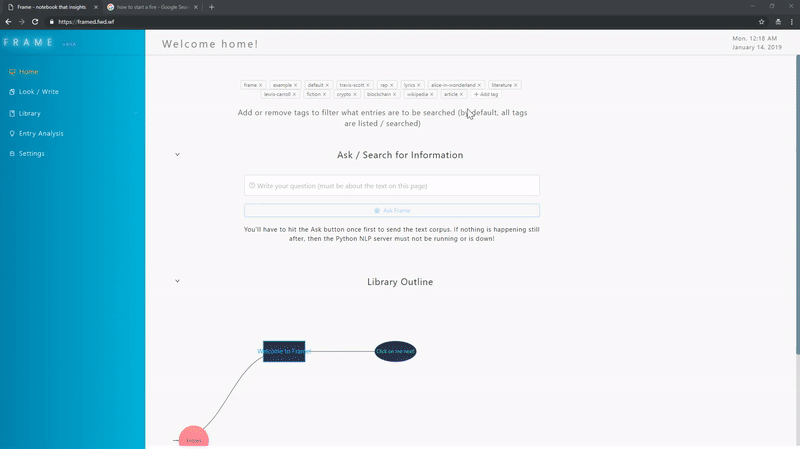

# Frame

Last release on 01/14/2019

# Links

Test online here: 

[https://framed.fwd.wf/](https://framed.fwd.wf/) 

Download the Windows release of version 0.1.0 here (last updated 01/14/2019)

[https://www.mediafire.com/folder/n151mdmi7je72/](https://www.mediafire.com/folder/n151mdmi7je72/) 

(Need a Mac user to build the MacOS version; Linux is untested, will update on that soon).

# Screenshots

Frame - 01-14-2019 release - demo use case for collecting and analyzing outdoors survival info - sped up by 2.5x

Frame extracting a web link with David Foster Wallace's This is Water essay - sped up by 2.125x

Frame analyzing Sicko Mode - sped up by 1.5x  

<!--  -->

<!-- Frame analyzing the Cryptocurrency Wikipedia article - Sped up by 2.5x -->

# Intro

Frame is a notetaking / journaling web and desktop application with natural language processing features, that allows users to retrieve informed answers in context to questions they can ask in the UI. Frame also automatically generates summaries (both extractive and abstractive) of the text. This analysis is done in real-time (on save), and can navigated intuitively while still editing the content. Frame is designed for introspective and analytical users (researchers and academics might be most interested in this).

Frame is fully functional without running the Python backend (no online API is available at this time). Most of the analysis is done within the app itself (with no external server calls). The data storage uses localForage (IndexedDB), which allows easy mass distribution for Frame (your data self-contained and never sent anywhere outside the local app or browser). Data can be exported and imported as JSON.

Eventually, a donation-supported / subscription-based edition could be serviced for online users through a server on the cloud, with extended features and protected data storage, and automated data extraction / ingestion.

Note: Frame is currently heavily unoptimized with some UI quirks. The project was created as a proof-of-concept but designed to work as a MVP as well. But it is fully functional!

Download Windows build (last updated 01/14/2019): [https://www.mediafire.com/folder/n151mdmi7je72/](https://www.mediafire.com/folder/n151mdmi7je72/)

# Installation

Download the binary for your OS. Installing (double-clicking) the binary file should extract all necessary data to the current directory, and you will be able to add a shortcut / icon that instance of Frame for future opening (without having to reinstall every time).

Frame is fully functional with just the offline application; however, the advanced NLP features (abstractive summarization and answer prediction) require a Python backend running PyTorch serving localhost on port 80. This can be automatically done by downloading the necessary Docker or Python files and either building and running the container or installing the library dependencies in a Python environment, and running the main script. If configured through the Docker image, the Python backend will use Nginx, and would be suitable for handling large volumes of traffic.

With just the client application features, Frame can still do extractive summarization and key information extraction. The majority of the NLP analysis is done within the app itself, not the Python server.

All the data is self-contained within the specific installation instance of Frame. So, to own multiple copies of Frame with different libraries of data, you can simply duplicate the downloaded binary and rename and use the duplicated applications as you wish.

# Todo List (In order of priority)

These are features that would make Frame considerably more robust in terms of usability and functionality. Some are stretch goals. The list will be modified as progress continues.

- Build Docker image of Python backend and deploy app on AWS

- Optimize / refactor app (reduce unnecessary re-renders; serialize editor states and store into database instead of rebuilding content from HTML every load, only re-run analysis when the entry text has changed, etc) 

- Separate out larger components (reduce size of components); clean up code; add better comments

- ~~Add feature to extract text content automatically from a given link when creating a new entry~~ (DONE)

- Add in full editing component for entry properties (title, tags, etc.); add in Last_Date_Modified property to entry data

- Add feature to automatically generate entries based off of file upload (PDF, text)

- Add setting to configure Python backend server address

- ~~Refine sentence / new line tokenization~~ (DONE)

- ~~Add new section where users can see summarizations and ask questions by groups of entries (like searching entries with related tags, or searching an entry and its sub-entries)~~ (DONE)

- Add in visual themes and switcher options

- Add full word processing editor, coding IDE, and equations / calculator screen

- Fix multimedia content uploading and saving in editor (and make it persistent across multiple editors)

- Add password protection / security settings

- Add in live view in Notepad component where users can see content and summarization and navigate both simultaneously side-by-side

- Add in voice recognition and synthesis for recognizing questions and outputting answers (with adjustable tone settings)

# Future

???

# Acknowledgements

Additional libraries and references used:

- AllenNLP [https://allennlp.org/](https://allennlp.org/)
- Ant Design [https://ant.design/](https://ant.design/)
- compromise [https://github.com/spencermountain/compromise](https://github.com/spencermountain/compromise)
- Draft.js [https://draftjs.org/](https://draftjs.org/)
- franc [https://github.com/wooorm/franc](https://github.com/wooorm/franc)
- electron-builder [https://www.electron.build/](https://www.electron.build/)
- LocalForage [https://localforage.github.io/localForage/](https://localforage.github.io/localForage/)
- medium-draft [https://github.com/brijeshb42/medium-draft](https://github.com/brijeshb42/medium-draft)
- node-sumbasic [https://github.com/MSVCode/node-sumbasic](https://github.com/MSVCode/node-sumbasic)
- pysummarization [https://pypi.org/project/pysummarization/](https://pypi.org/project/pysummarization/)
- React Draft WYSIWYG [https://jpuri.github.io/react-draft-wysiwyg/#/](https://jpuri.github.io/react-draft-wysiwyg/#/)
- react-aria-tabpanel [https://github.com/davidtheclark/react-aria-tabpanel](https://github.com/davidtheclark/react-aria-tabpanel)
- react-electron-web-boilerplate [https://github.com/MikeyFriedChicken/react-electron-web-boilerplate](https://github.com/MikeyFriedChicken/react-electron-web-boilerplate)
- react-json-view [https://github.com/mac-s-g/react-json-view](https://github.com/mac-s-g/react-json-view)
- react-sortable-tree [https://github.com/frontend-collective/react-sortable-tree](https://github.com/frontend-collective/react-sortable-tree)
- Recharts [https://github.com/recharts/recharts](https://github.com/recharts/recharts)
- uwsgi-nginx-flask-docker [uwsgi-nginx-flask-docker](uwsgi-nginx-flask-docker)