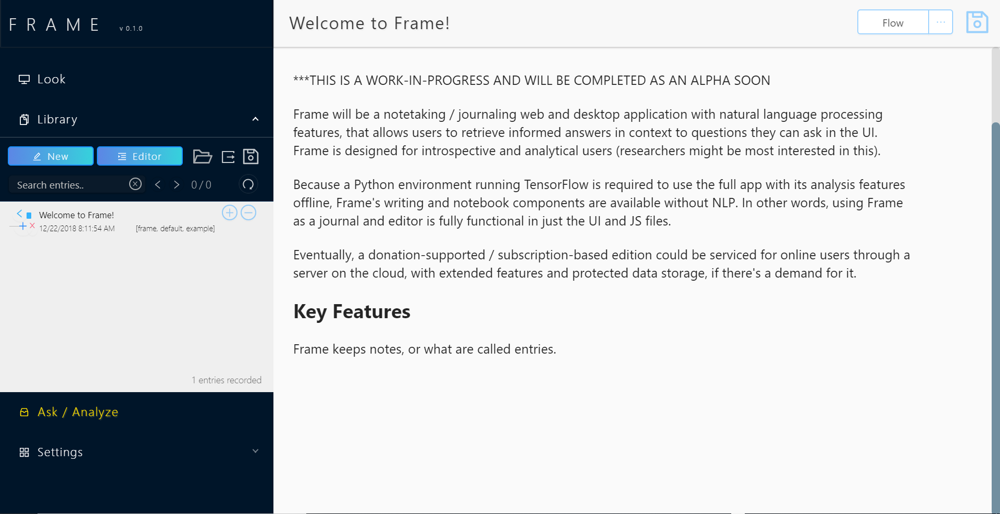
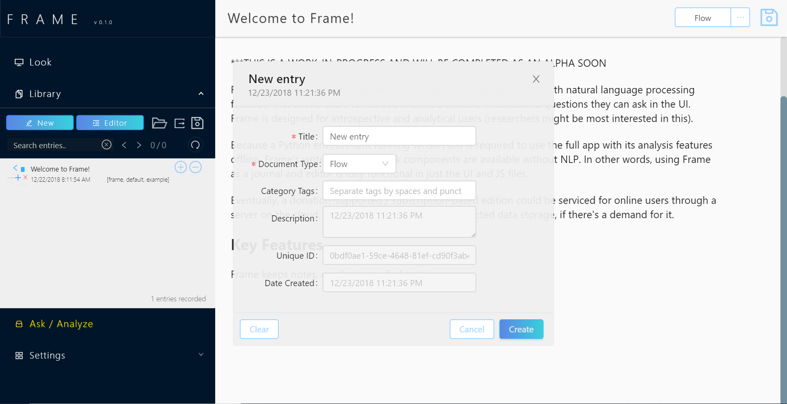
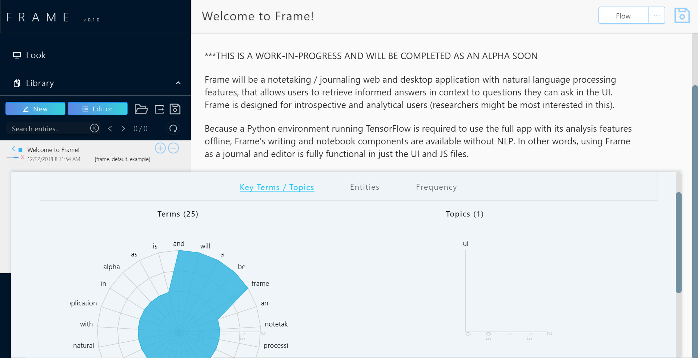
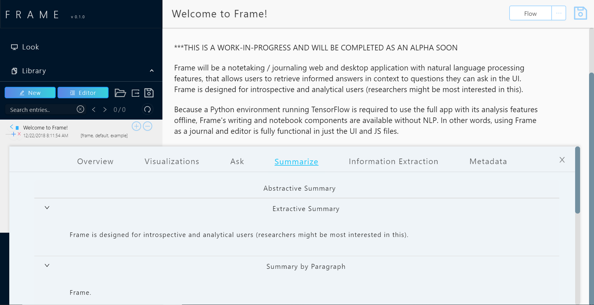
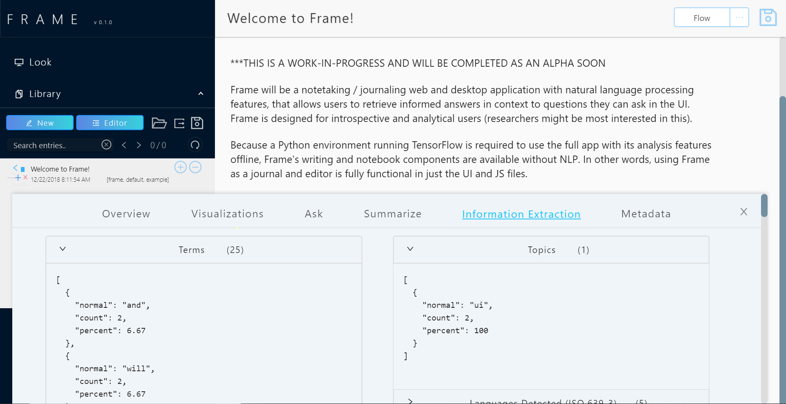

# Frame

***THIS IS A WORK-IN-PROGRESS AND WILL BE COMPLETED AS AN ALPHA SOON

Frame will be a notetaking / journaling web and desktop application with natural language processing features, that allows users to retrieve informed answers in context to questions they can ask in the UI. Frame is designed for introspective and analytical users (researchers might be most interested in this).

Because a Python environment running TensorFlow is required to use the full app with its analysis features offline, Frame's writing and notebook components are available without NLP. In other words, using Frame as a journal and editor is fully functional in just the UI and JS files.

 Eventually, a donation-supported / subscription-based edition could be serviced for online users through a server on the cloud, with extended features and protected data storage, if there's a demand for it.

## Current Screenshots (12-23-2018)

This is a fully functional build, without the Python backend running for the Ask freature.

## Key Features

Frame keeps notes, or what are called entries.

# Installation

## NLP Backend

## Web UI

## Desktop UI

# Future

# Acknowledgements

Additional libraries and references used:

- AllenNLP [https://allennlp.org/](https://allennlp.org/)
- Ant Design [https://ant.design/](https://ant.design/)
- compromise [https://github.com/spencermountain/compromise](https://github.com/spencermountain/compromise)
- Draft.js [https://draftjs.org/](https://draftjs.org/)
- franc [https://github.com/wooorm/franc](https://github.com/wooorm/franc)
- electron-builder [https://www.electron.build/](https://www.electron.build/)
- LocalForage [https://localforage.github.io/localForage/](https://localforage.github.io/localForage/)
- medium-draft [https://github.com/brijeshb42/medium-draft](https://github.com/brijeshb42/medium-draft)
- node-sumbasic [https://github.com/MSVCode/node-sumbasic](https://github.com/MSVCode/node-sumbasic)
- React Draft WYSIWYG [https://jpuri.github.io/react-draft-wysiwyg/#/](https://jpuri.github.io/react-draft-wysiwyg/#/)
- react-aria-tabpanel [https://github.com/davidtheclark/react-aria-tabpanel](https://github.com/davidtheclark/react-aria-tabpanel)
- react-electron-web-boilerplate [https://github.com/MikeyFriedChicken/react-electron-web-boilerplate](https://github.com/MikeyFriedChicken/react-electron-web-boilerplate)
- react-json-view [https://github.com/mac-s-g/react-json-view](https://github.com/mac-s-g/react-json-view)
- react-sortable-tree [https://github.com/frontend-collective/react-sortable-tree](https://github.com/frontend-collective/react-sortable-tree)
- Recharts [https://github.com/recharts/recharts](https://github.com/recharts/recharts)
- uwsgi-nginx-flask-docker [uwsgi-nginx-flask-docker](uwsgi-nginx-flask-docker)